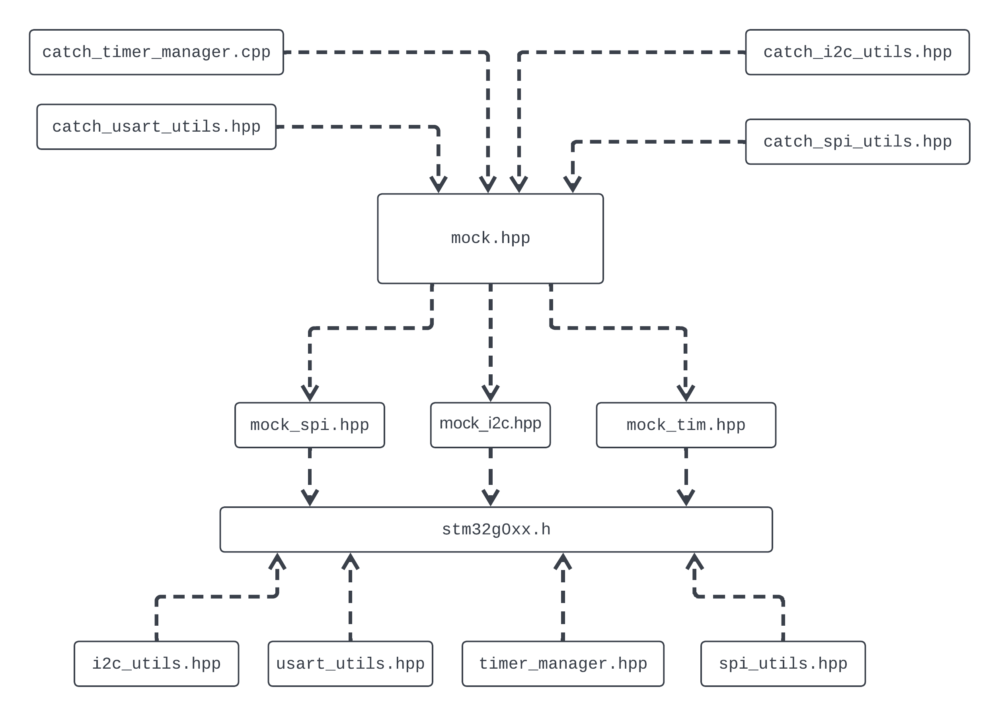

## Running Units Tests on X86

Open this project in VSCode to run the unit tests. The build output is linked with the Catch2 library, so to run the unit tests you only need to run the build:
`./build/test_suite`

See `.vscode/tasks.json` for details on the individual toolchain commands.

## CMSIS Mocking

The `mocks` directory contains a modified version of the ST's [stm32g0xx.h](mocks/stm32g0xx.h). 

- All peripheral typedefs (TIM_TypeDef, SPI_TypeDef, etc...) have their memebers initialised to zero values (0x00000000) 
- All the peripheral declarations (TIM1, SPI3, etc...) are non-const so that they can be instatiated in unit tests.
- Limited peripheral functionality has been recreated (timer count, SPI/I2C/USART FIFO status checking, etc..). These functions should be used in separate threads so that they can act on the registers independent from the unit tests. Examples can be found in [catch_i2c_utills](catch_i2c_utils.cpp#L64) amongst others.

The dependency tree of the mocks are structured so that the drivers should still include `stm32g0xx.h`. This means that the driver `stm32g0xx.h` dependency will resolve correctly when building for both x86-based unit test and the STM32 target.

Unit tests should include the [mock.hpp](mocks/mock.hpp) file, which holds additional STL libraries useful for testing but unsuitable for a microcontroller target.



New drivers automatically include the `mock.hpp` header during unit testing build. See [CMakeFiles.txt](../CMakeLists.txt#L14):

```
add_definitions(-include ${CMAKE_SOURCE_DIR}/tests/mocks/mock.hpp) 
```

If a unit test needs to use other drivers within this project, it should include them directly. For example, [catch_usart_utils.hpp](catch_usart_utils.cpp) uses both the `usart_utils` and `timer_manager`, so its includes are:

```
#include <timer_manager.hpp>
#include <usart_utils.hpp>
```


